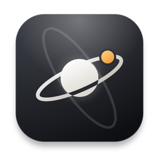

<p align="center">
  
</p>

<h1 align="center">Orbit Lite</h1>

<p align="center">
  A local-first markdown editor for people whose notes live in more than one place.
</p>

<p align="center">
  <a href="LICENSE"></a>
  
</p>

A **SvelteKit + [Edra](https://edra.tsuzat.com)** port of
[Orbit](https://github.com/fkrndev/orbit), which is React + BlockNote. Same product, same files on
disk, same four ideas — a different front end.

---

## What it is

There is no vault. The first file you open *is* the configuration: every folder you touch is
remembered, and `⌘P` searches all of them at once, so notes about a client, a repo's `docs/`, and
last year's journal are findable together without ever being moved into the same place.

Tags, pins, and per-file notes live in sidecar JSON under the app's own data directory. **None of it
is written into your markdown**, and nothing is ever dropped into a folder you opened. Delete the
app tomorrow and every note is byte-for-byte what it was.

Frontmatter that is genuinely in the file is treated as the file's own: read and edited in the
inspector by line surgery, so changing one key cannot reformat, reorder, or reflow another.

**`⇧⌘L` is read-only**, and it means it: the app refuses every write to your folders — text,
frontmatter, rename, trash — at one gate rather than by disabling buttons, so reading someone's
notes cannot end with having changed them. Pins and tags still work; they live in the sidecar and
never touch your markdown. Whatever you had typed is flushed to disk before the lock closes.

`⌘K` writes a **relative markdown link** — readable by GitHub, by `cat`, by anything. The rich
editor and the raw source (`⌘/`) are two views of the same bytes, not two formats.

The longer argument for all of this is in [Orbit's README](https://github.com/fkrndev/orbit); it has
not changed.

## Running it

```bash
bun install
bun run dev          # desktop app, and the same app in a browser tab at :5373
bun run dev:browser  # browser only, no Electrobun
bun run build:stable # DMG in artifacts/
```

Both surfaces talk to one Bun process that owns the JSON stores, so they can be open at once
without racing each other.

## Shipping an update

```bash
bun run release patch   # bump the version, rebuild, publish the GitHub Release
```

That one command is the whole release: the app checks
`releases/latest/download/stable-macos-arm64-update.json` on launch, downloads in the background,
and offers a Restart. The bump has to precede the build — the version is baked into the bundle —
which is why the script does both rather than leaving the order to be remembered.

Updates arrive as a **bsdiff patch against the previous release** (kilobytes) and fall back to the
full compressed tarball when there is no patch to apply — a fresh install from the DMG has no
previous tarball on disk, so its first update is a full download and every one after it is a delta.

Orbit Lite deliberately uses **its own identifier and ports** (`local.orbitlite.app`, 5373/5374)
rather than the React build's (`local.markdown.app`, 5273/5274). The two can run side by side; they
do not share a single tag, pin, or open tab.

## What is different from Orbit

| | Orbit | Orbit Lite |
|---|---|---|
| Framework | React 19 | Svelte 5 (runes) + SvelteKit |
| Rich editor | BlockNote | Edra over Tiptap |
| Components | shadcn/ui, `radix-nova` | shadcn-svelte, `nova` |
| Backend | `src/bun` | **the same `src/bun`**, four lines changed |
| Markdown round trip | BlockNote blocks + durable-fence codecs | `@tiptap/markdown` + `compactMarkdown` |

The design tokens, the reading typography, and every decision the interface encodes are ported
verbatim — the palette in `src/app.css` is Orbit's, comment for comment.

### Not ported

- **Collapsible heading sections.** BlockNote-specific; there is no Tiptap equivalent in place yet.
  The parked test is in `port/from-react/`.
- **The rich formatting toolbar's own test.** Edra ships the toolbar; the React test asserted
  BlockNote's.

## Licence

AGPL-3.0-or-later, inherited from Orbit, which is itself a modified version of
[Tolaria](https://github.com/refactoringhq/tolaria). See [NOTICE](NOTICE).

Because this app can be served over HTTP (`bun run dev:browser`), anyone reaching it over a network
is a user the licence requires an offer of source to — which is why Settings → About carries the
repository link rather than burying it here.
